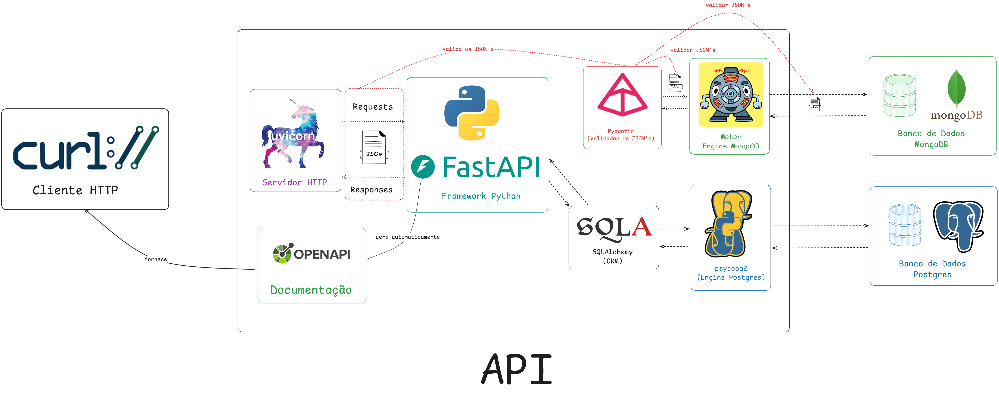

# 🎵 Rato Player

<div align="center">
  
</div>

API REST para gerenciamento de coleções musicais com Python + FastAPI.

## 🛠 Tecnologias

- **Poetry**: Gerenciador de dependências e ambientes virtuais Python
- **FastAPI**: Framework web moderno para criação de APIs REST com documentação automática
- **SQLAlchemy**: ORM para interação com banco de dados PostgreSQL
- **Motor**: Driver async para MongoDB com Python
- **Pydantic**: Validação de dados e serialização com type hints
- **Ruff**: Linter e formatador de código Python ultra-rápido
- **pytest**: Framework de testes unitários

## 🏗️ Diagrama da Arquitetura



## 🚀 Instalação
Optamos por usar o [Poetry](https://python-poetry.org/) como gerenciador de pacotes no lugar do Pip. É necessário instalá-lo antes.

```bash

git clone https://github.com/gustaaragao/rato-player.git
cd rato-player
poetry install
poetry shell
```

## ⚙️ Configuração

Crie um `.env` como o `.env.example`:
```env
# Postgres
POSTGRES_HOST=
POSTGRES_PORT=
POSTGRES_DB_NAME=
POSTGRES_USER=
POSTGRES_PASSWORD=

# MongoDB
MONGODB_HOST=
MONGODB_PORT=
MONGODB_DB_NAME=
MONGODB_USER=
MONGODB_PASSWORD=
```

## 🏃‍♂️ Execução

```bash
# Desenvolvimento
task run

# Testes (⚠️ atualmente não há testes implementados)
task test

# Formatar o código
task format
task lint
```

**API:** `http://localhost:8000`  
**Docs:** `http://localhost:8000/docs`

## 🛣 API Endpoints

O projeto oferece **dois conjuntos completos de APIs** idênticas:
- **PostgreSQL**: `/postgres/generos/` e `/postgres/colecoes/` (relacional)
- **MongoDB**: `/mongo/generos/` e `/mongo/colecoes/` (documento)

Ambas implementações compartilham os mesmos schemas Pydantic e oferecem funcionalidades idênticas.

### Gêneros (PostgreSQL: `/postgres/generos/` | MongoDB: `/mongo/generos/`)
- `POST /` - Criar
- `GET /` - Listar (paginação)
- `GET /buscar` - Buscar por nome/data
- `GET /{id}` - Obter por ID
- `PUT/PATCH /{id}` - Atualizar
- `DELETE /{id}` - Excluir

### Coleções (PostgreSQL: `/postgres/colecoes/` | MongoDB: `/mongo/colecoes/`)
- `POST /` - Criar
- `GET /` - Listar (paginação)
- `GET /buscar` - Buscar por título/tipo/data
- `GET /{id}` - Obter por ID
- `PUT/PATCH /{id}` - Atualizar
- `DELETE /{id}` - Excluir
- `POST/DELETE /{id}/generos/{genero_id}` - Gerenciar relacionamentos

## 📖 Exemplo de Uso

### PostgreSQL (IDs inteiros)
```bash
# Criar gênero
curl -X POST "http://localhost:8000/postgres/generos/" \
     -H "Content-Type: application/json" \
     -d '{"nome": "Rock", "surgiu_em": "1950-01-01"}'

# Criar coleção
curl -X POST "http://localhost:8000/postgres/colecoes/" \
     -H "Content-Type: application/json" \
     -d '{
       "titulo": "Dark Side of the Moon",
       "tipo": "Album",
       "duracao": 2580,
       "caminho_capa": "/covers/dsotm.jpg",
       "data_lancamento": "1973-03-01"
     }'
```

### MongoDB (IDs string/ObjectId)
```bash
# Criar gênero (mesma estrutura, endpoint diferente)
curl -X POST "http://localhost:8000/mongo/generos/" \
     -H "Content-Type: application/json" \
     -d '{"nome": "Jazz", "surgiu_em": "1900-01-01"}'

# Criar coleção (mesma estrutura, endpoint diferente)
curl -X POST "http://localhost:8000/mongo/colecoes/" \
     -H "Content-Type: application/json" \
     -d '{
       "titulo": "Kind of Blue",
       "tipo": "Album", 
       "duracao": 2876,
       "caminho_capa": "/covers/kob.jpg",
       "data_lancamento": "1959-08-17"
     }'
```
